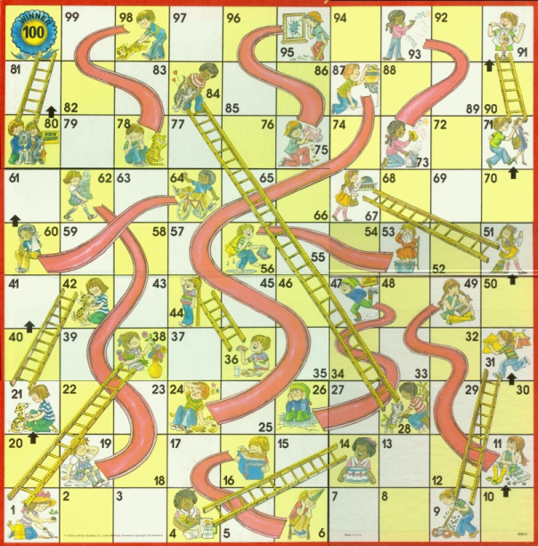
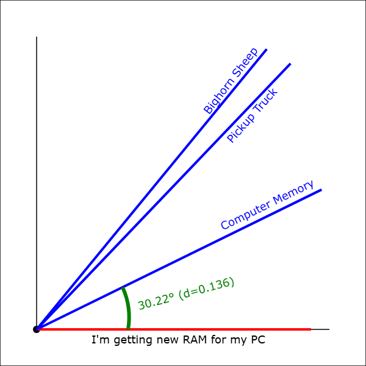

# Amazing Algorithms

By Barry Stahl, Tues 1.13.26 @ 8:00 AM

Slides for the presentation:
https://cognitiveinheritance.com/Presentations/ShortWorkshop/AmazingAlgorithms/

Some more slides, but not the same ones used in this presentation:
https://amazingalgorithms.azurewebsites.net/

## Session Description

From genetic algorithms to ant colonies, nature has inspired some of the most powerful problem-solving techniques in computer science. This comprehensive workshop takes you on a journey through three interconnected approaches to algorithmic problem-solving: Dynamic Programming as a foundational technique for optimal decision-making, Genetic Algorithms for evolving solutions to complex optimization problems, and Bio-inspired Algorithms like Firefly and Ant Colony for tackling challenging search spaces. Through hands-on examples and practical implementations, you'll learn how to identify which algorithm suits different types of problems, implement these techniques in your language of choice, and analyze the tradeoffs of each approach. We'll progress from implementing basic Dynamic Programming solutions to building self-improving systems with Genetic Algorithms and finally explore how nature-inspired algorithms can solve problems that traditional approaches struggle with. You'll leave with a powerful toolbox of algorithmic techniques, practical implementation knowledge, and the ability to apply these approaches to real-world optimization, search, and decision-making problems in your own systems. Whether you're building resource schedulers, network optimizers, or automated decision engines, these battle-tested algorithms will give you new ways to tackle complex problems elegantly and efficiently.

## My Notes

### Problem #1 - Knapsack problems

e.g. knapsack capacity = 9 lbs

- item1: value $5M, weight 4 lbs
- item2: value $6M, weight 5 lbs
- item3 value $3M, weight 2 lbs

1. Use Memoization to build a table: X is item taken, Y is capacity, value of the cell is the total value of the items.
2. Work backwards from greatest number to see whether you picked each item or not.

_Dynamic Programming_ - a mathematical optimization technique

- best for solving problems that can be described recursively
- breaks the problem into smaller su-problems
- solves each small problem only ONCE
- guarantees an optimal solution

_Optimization Problems_ - find the best values for a set of decision variables that

- Satisfies all constraints
- Maximizes features we want
- Minimizes those we don't

### Simple example - chutes and ladders

...assuming we can choose where to go to make the optimal path (similar to what google maps does with A\*, for example)

#### Greedy Algorithm

- Start at the 1st space on the board
- While we haven't reached the final space
  - Add the space to the current path
    - if current space has a ladder
      - add the end of the ladder to the path
      - make that the current space

#### Dynamic Programming: DETERMINDISTANCE(S,D)

- Call DetermineDistance(space[0], 0)
- If shorter than previously found
  - Set DistanceFromStart property
  - if this space starts a chute or ladder
    - DetermineDistance(endOfNavigation, distanceFromStart+1)
  - If not at the end of the board
    - DetermineDistance(nextSpace, distanceFromStart+1)
- return all spaces with their DistanceFromStart value populated

### Dynamic Programming Summary

- populate cache
- use cached data to determine answer
- guaranteed optimality
- works with any graph (nodes & edges)

### Genetic Algorithm/Programming

Evolves solution by mimicking natural selection

#### DNA

- Chromosomes: all possible decisions that can be made
- Genes: a decision to be made
  - Ideally a Gene fully describes a single game state
  - if no decision is possible for a state, there is no gene for that state
- Allele: an option for that decision
  - If there are three options for a given state there will be three possible alleles for that gene

#### Parameters

- Simulations per generation
- Generation count
- Error (misspelling) rate
- Selection strategy

E.g. Assign one player the "shortest path" strategy. Assign strategies to all players (don't have to all be different strategies). Let them race and see who wins!

#### Options for Experimentation

- Implement in your preferred language
- Augment to include what PLACE the player is in
  - i.e. Might make different decisions if 1st vs 6th
- Augment to include opponent locations
  - i.e. Might make different decisions if opponents are close to the end
- Define the DNA of another game
- Track history of DNA

### Problem #2 - Semantic Distance

### Embeddings

- Point in multidimensional space
- Mathematical representation of a word or phrase
- Encode semantic and contextual information

### Cosine similarity & Distance

- Ranges from -1 to 1 where:
  - +1 indicates that the vectors represent similar semantics & context
  - 0 indicates the vectors are orthogonal (no similarity)
  - -1 indicates the vectors have opposing semantics & context
- Cosine Distance is defined as 1 - cosine similarity where:
  - 0 = synonomous
  - 1 = orthogonal
  - 2 = antonymous

> Ram - computer memory, sheep, or truck?

Note: for normalized vectors, cosine similarity is the same as the dot-product

#### Embedding Distance

- Synonym - "Happy" is closer to "Joyful" than "Sad"
- Language - "The Queen" is very close to "La Reina"
- Idiom - "He kicked the bucket" is closer to "he died" than "He kicked the ball"
- Sarcasm - "Well, look who's on time" is closer to "Actually Late" than "Actually Early"
- Homonym - "Bark" (dog sound) is closer to "Howl" than "Bark" (tree layer)
- Collation - "Fast food" is closer to "Junk food" than "fast car"
- Proverb - "The early bird catches the worm" is closer to "Success comes to those who prepare well and put in effort" than to "A bird in the hand is worth two in the bush"
- Metaphor - "Time is money" is closer to "Don't waste your time" than to "Time flies"
- Simile - "He is as brave as a lion" is closer to "He is very courageous" than to "He is a lion"

#### Modeling Exercise

Design a system to find words/phrases that are far apart (semantically different) in the embedding space.

- Assume no DB of embeddings available to search, and limited understanding of the features of the embedding space (i.e. changing language changes nearly every dimension)
- What types of models might work?
  - Can we do it logically?
  - Can we brute force it?
  - Hybrid approach?
- What are the features of each model?
- How do we execute the model(s)?

### Bio-inspired Algorithms

- Best Path Algorithms
  - Any colony optimization
  - Bee colony optimization
- Cost Reduction Algorithms
  - Firefly optimization
  - Amoeba optimization
- AI Models
  - Intro to optimizing AI models
  - Training an AI model using amoebas
